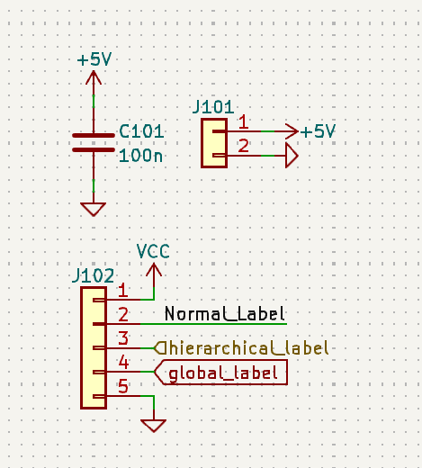
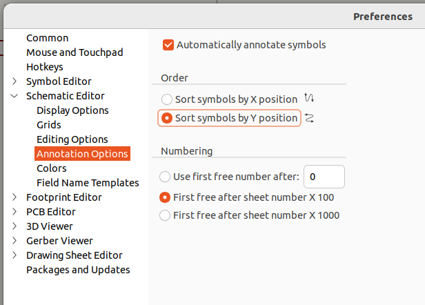

# Aesthetics

Aesthetic matters a lot too in designing Schematics and PCBs. 

## Schematics

#### Reference image

### Symbols
1. Always use kicad's in-built library for symbols
2. make your own symbols/ use symbols downloaded from online **if and only if** the library does not have a similar symbol for it. the chances are, unless you need a symbol for a custom board (for architectural schematics) or a IC chip, there will be a symbol made fo it.

### Grid
1. **All** items in the schematic should minimally align to a 1.27mm grid. Symbols should align to a 2.54mm grid, see [reference image](#reference-image)

### Annotation
#### Designator
Use the following preferences:

by using `free after sheet number X 100`, annotation will be `[ref]XXX`, this will pad all the numbers to 3 digits: aesthetically nicer. when using multiple sheets, the first digit will be the sheet number, easier to identify when making a PCB. 

The designator of a symbol is usually a few units away from the symbol, try to move them (aligned to grid!) right beside the symbol. see [reference image](#reference-image), Power Symbols and Capacitor annotations.

#### Value
Values of capacitance/ resistance/ etc. of the symbol.

The `SI Unit` need not be included in the value if it can be implied (ie. capacitor: 100nF, 'F' can be dropped; resistance: 10kΩ, 'Ω' can be dropped)

The `unit prefix` need must included in the value, further act as the decimal point in the value. 

(ie. 5.1kΩ => 5k1, 2.2uF => 2u2). 

This convention is to clearly distinguish decimal values. Therefore, it is imperative that one notes the decimal points (ie. 2u2 vs 22u)  

### Wiring
1. At least 1 unit (2.54mm) of wire before any junction/ connection, see [reference image](#reference-image)
2. if your schematics have many non-connected wires cutting across each other, consider using [labels](#labels)

### Labels
Labels acts as a wire, connecting all same-labelled connections together.
- Normal labels are used to label a connection on the SAME sheet
- Hierarchical labels are used to label connections in the SAME sheet + the level above (more advanced topic, see [sheets](#sheets))
- Global labels are used to label connections everywhere

Generally i will use hierarchical labels as a connection on SAME sheet, looks nice too.

### Power Symbols
#### Power
> This includes **all** power symbols that is **NOT** Ground 
- Acceptable orientations: `Left, Right, Up`
- Designator: `required`

#### Ground
- Acceptable orientations: `Left, Right, Down`
- Designator: `not required`, the label `Ground` is not needed, it is implied that by using the symbol + lack of label, it is common ground.

\* not labelling `Ground` only applies to `common ground`, other grounds such as `VSSA` should be labelled.

## PCB

### Routing
- **all** traces should be 45 Degress

### Edges
- **all** corners must be filleted with `at least 3 mm`
- **all** PCBs must have at least 2 mounting points

